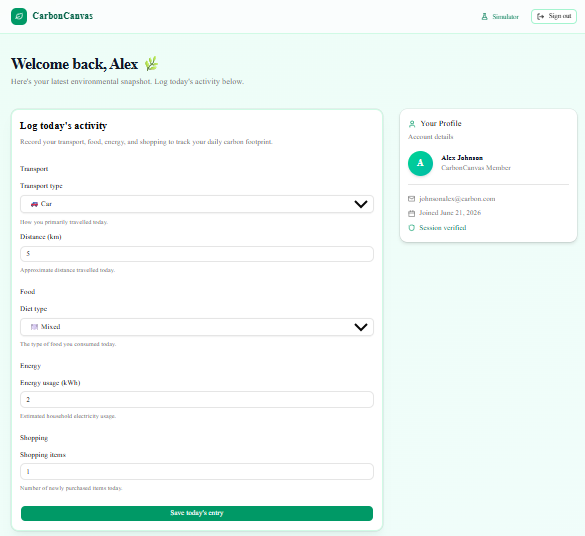
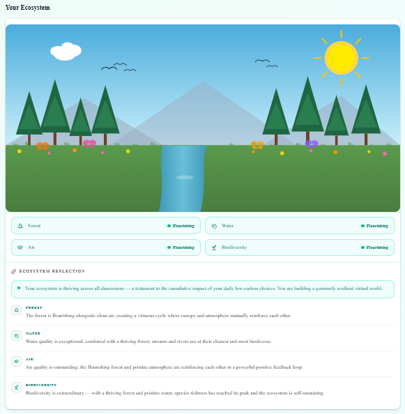
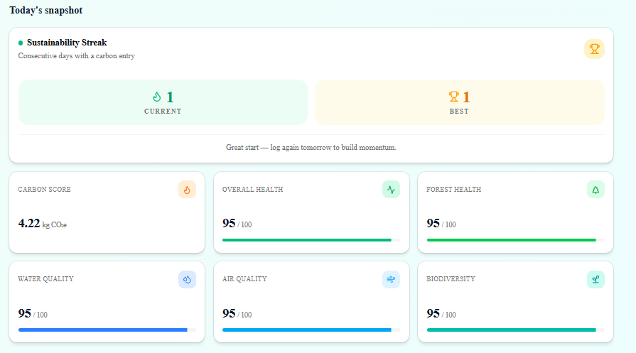
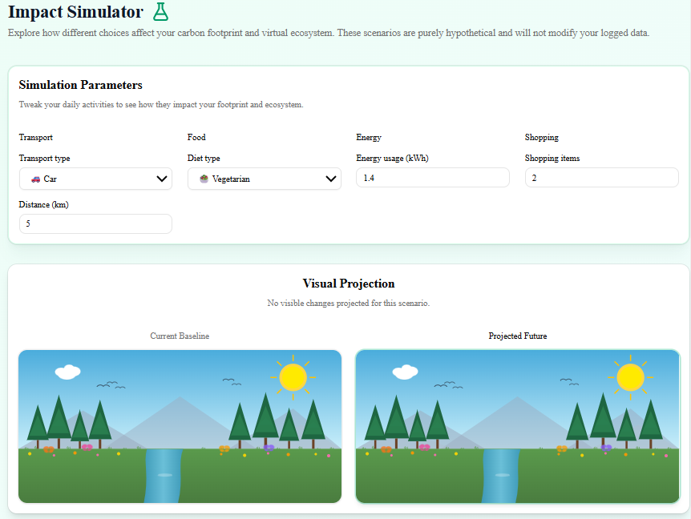
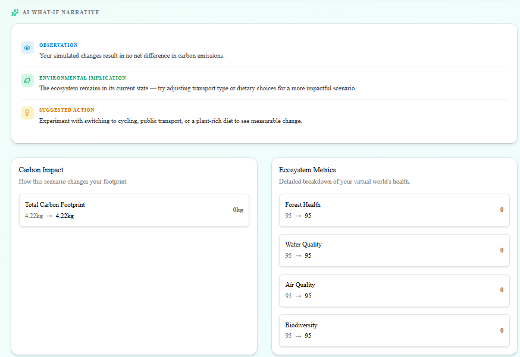

# CarbonCanvas 🌿

> A Carbon Footprint Awareness Platform that transforms carbon tracking into an interactive, living ecosystem experience.

Built for the **PromptWars Challenge 3**, CarbonCanvas goes beyond numbers by visualising the real-world impact of your daily choices through a dynamic, AI-reflected virtual environment.

---

## 📸 Screenshots

| Dashboard Overview | Ecosystem Canvas | Ecosystem Snapshot | Impact Simulator | AI Narratives |
|:---:|:---:|:---:|:---:|:---:|
|  |  |  |  |  |

---

## 🎯 Problem Statement

Many individuals are unaware of the environmental impact of their daily activities. Existing carbon tracking solutions often present data in a numerical format that fails to create emotional engagement or lasting behavioural change. CarbonCanvas solves this by turning carbon data into a living digital ecosystem — one that visibly flourishes or degrades based on your choices, creating a visceral, personal connection to sustainability.

---

## ✨ Core Features

- **Daily Activity Logging**: Seamlessly record transport, food, energy usage, and shopping habits.
- **Carbon Footprint Calculation**: Deterministic algorithms calculate precise daily CO₂e emissions.
- **Living Ecosystem Visualization**: Watch your personal SVG-based ecosystem flourish or degrade based on your cumulative choices — spanning forest health, water quality, air quality, and biodiversity.
- **Ecosystem Status Badges**: At-a-glance health tier badges (At Risk → Recovering → Healthy → Flourishing) for each ecosystem dimension.
- **Deterministic AI Reflections**: A pure, template-driven reflection engine generates cross-dimensional narrative insights about your ecosystem state — no API key required.
- **Impact Simulator**: An interactive what-if simulator at `/simulator` that lets you experiment with hypothetical lifestyle changes and preview their effect on your carbon score and virtual ecosystem side-by-side.
- **AI What-If Narratives**: Gemini Flash generates a personalised three-part narrative (Observation, Implication, Suggested Action) for each simulation result. Falls back to deterministic templates when no API key is configured.
- **Ecosystem Comparison Visualization**: Side-by-side current vs. projected ecosystem canvases inside the Impact Simulator.
- **Sustainability Streaks**: Track your current and longest consecutive logging streaks on the progress dashboard.
- **Progress Dashboard**: View your carbon score, overall health, and individual ecosystem metrics with progress bars.

---

## 🛠 Tech Stack

- **Framework**: [Next.js](https://nextjs.org/) (App Router & Server Actions)
- **Language**: TypeScript
- **Database & Auth**: [Supabase](https://supabase.com/) (PostgreSQL + Row Level Security)
- **AI Intelligence**: [Gemini Flash 2.0](https://deepmind.google/technologies/gemini/) via `@google/generative-ai`
- **Styling**: Tailwind CSS (v4, CSS-first configuration)
- **Components**: [shadcn/ui](https://ui.shadcn.com/) + Radix UI
- **Validation**: [Zod](https://zod.dev/)
- **Testing**: [Vitest](https://vitest.dev/)

---

## 🚀 Getting Started

### 1. Prerequisites

Ensure you have the following installed:
- Node.js (v18+)
- npm (or pnpm / yarn)
- A Supabase account ([supabase.com](https://supabase.com))
- A Google AI Studio API key ([aistudio.google.com](https://aistudio.google.com/apikey)) — *optional; the simulator falls back to deterministic templates if absent*

### 2. Installation

Clone the repository and install dependencies:

```bash
git clone https://github.com/KumarNayan11/CarbonCanvas.git
cd CarbonCanvas
npm install
```

### 3. Environment Variables

Create a `.env.local` file in the root directory. See `.env.example` for a reference template.

```env
# Supabase — Required
NEXT_PUBLIC_SUPABASE_URL=https://<your-project-ref>.supabase.co
NEXT_PUBLIC_SUPABASE_ANON_KEY=<your-anon-key>

# Gemini AI — Optional
# If absent, the Impact Simulator uses deterministic fallback narratives.
GEMINI_API_KEY=<your-gemini-api-key>
```

> **Note:** Never commit your `.env.local` file. It is already listed in `.gitignore`.

### 4. Database Setup

The complete database schema, indexes, RLS policies, and auth triggers are defined in `supabase/schema.sql`.

1. Open your [Supabase SQL Editor](https://supabase.com/dashboard).
2. Copy the contents of `supabase/schema.sql`.
3. Paste and run it to create the `profiles`, `daily_entries`, `ecosystem_states`, and `insights` tables.

### 5. Running Locally

Start the development server:

```bash
npm run dev
```

Visit [http://localhost:3000](http://localhost:3000) to view the application.

**Other available scripts:**

| Command | Description |
|---|---|
| `npm run build` | Build for production |
| `npm run lint` | Run ESLint |
| `npm run typecheck` | Run TypeScript type-checking |
| `npm run test` | Run unit tests with Vitest |
| `npm run test:watch` | Run Vitest in watch mode |
| `npm run test:coverage` | Generate test coverage report |

---

## 🚀 Deploying to Vercel

CarbonCanvas deploys to Vercel without any additional configuration file (`vercel.json`). The default Next.js 16 adapter handles everything automatically.

### Prerequisites

- A [Vercel account](https://vercel.com) connected to your GitHub repository.
- Your Supabase project and (optionally) a Google AI Studio API key.

### Step-by-step

1. **Push to GitHub** — Vercel auto-deploys on every push to `main`.

2. **Connect the repo** in Vercel Dashboard → New Project → Import from GitHub.

3. **Set environment variables** in *Project Settings → Environment Variables*:

   | Variable | Required | Description |
   |---|---|---|
   | `NEXT_PUBLIC_SUPABASE_URL` | ✅ Yes | Your Supabase project URL |
   | `NEXT_PUBLIC_SUPABASE_ANON_KEY` | ✅ Yes | Supabase public anon key |
   | `GEMINI_API_KEY` | ⬜ Optional | Gemini Flash API key. When absent the simulator uses deterministic template narratives. |

   > **Never** put your Supabase `service_role` key or any private key in Vercel environment variables accessible from client-side code.

4. **Deploy** — Click *Deploy*. Vercel runs `npm run build` automatically.

5. **Supabase CORS** — Add your Vercel deployment URL (e.g. `https://carbon-canvas.vercel.app`) to the *Allowed Origins* list in your Supabase Dashboard under **Auth → URL Configuration**.

---

## 🏛 Architecture Overview

CarbonCanvas strictly adheres to Next.js App Router best practices:

- **Server-First Approach**: UI components are React Server Components by default to minimise client bundle size.
- **Server Actions**: All form submissions, database mutations, and external API calls (Supabase, Gemini) are securely handled via Server Actions in `src/app/actions/`.
- **Pure Domain Logic**: The core calculation services (`carbon-calculator.ts`, `ecosystem-engine.ts`, `streak-calculator.ts`, `health-tier.ts`, `ecosystem-reflection.ts`) are deterministic, unit-tested, and fully decoupled from React or database operations.
- **Append-Only Ecosystem History**: Ecosystem states are stored as append-only records, preserving the full historical timeline for trend analysis and AI reflections (see `docs/architecture.md § ADR-001`).
- **Gemini Fallback**: The AI narrative pipeline (`simulator-narrative.ts`) always returns a result — falling back to deterministic templates when `GEMINI_API_KEY` is absent or the API call fails.

---

## 📂 Folder Structure

```text
CarbonCanvas/
├── src/
│   ├── app/                    # Next.js App Router pages and layouts
│   │   ├── actions/            # Server Actions
│   │   │   ├── auth.ts         # Sign-up / sign-in / sign-out
│   │   │   ├── carbon.ts       # Daily carbon entry submission
│   │   │   └── simulator.ts    # AI what-if narrative generation
│   │   ├── dashboard/          # Protected dashboard route
│   │   │   └── page.tsx
│   │   ├── login/              # Authentication pages
│   │   │   └── page.tsx
│   │   ├── signup/
│   │   │   └── page.tsx
│   │   ├── simulator/          # Impact Simulator route
│   │   │   └── page.tsx
│   │   ├── layout.tsx          # Global App Layout
│   │   ├── page.tsx            # Landing Page
│   │   └── globals.css         # Tailwind v4 directives & design tokens
│   ├── components/             # Reusable UI components
│   │   ├── auth/               # Login/signup form components
│   │   ├── carbon/             # Activity logger, streak card, simulator UI
│   │   │   ├── carbon-entry-form.tsx
│   │   │   ├── simulator-client.tsx
│   │   │   ├── simulator-narrative-panel.tsx
│   │   │   └── streak-card.tsx
│   │   ├── ecosystem/          # SVG canvas & reflection panels
│   │   │   ├── ecosystem-canvas.tsx
│   │   │   ├── ecosystem-comparison.tsx
│   │   │   ├── ecosystem-reflection-panel.tsx
│   │   │   └── ecosystem-status-badges.tsx
│   │   ├── accessibility/      # A11y helpers
│   │   │   └── skip-to-content.tsx
│   │   └── ui/                 # shadcn/ui primitives (button, card, etc.)
│   ├── lib/                    # Third-party wrappers
│   │   └── supabase/           # Supabase client, server, middleware, env
│   ├── services/               # Core domain logic (pure functions)
│   │   ├── carbon-calculator.ts    # Emission factor calculations
│   │   ├── ecosystem-engine.ts     # Carbon score → ecosystem health
│   │   ├── ecosystem-reflection.ts # Deterministic narrative reflections
│   │   ├── health-tier.ts          # 0–100 metric → tier label & style
│   │   ├── impact-simulator.ts     # What-if scenario engine
│   │   ├── simulator-narrative.ts  # Gemini AI narrative generation
│   │   └── streak-calculator.ts    # Consecutive logging streaks
│   └── types/
│       └── index.ts            # Shared TypeScript interfaces
├── supabase/
│   └── schema.sql              # Unified DB schema, RLS policies, triggers
├── tests/                      # Vitest unit tests
│   ├── carbon-calculator.test.ts
│   └── ecosystem-engine.test.ts
└── docs/                       # Architecture Decision Records & specs
```

---

## ♿ Accessibility (a11y)

CarbonCanvas is built with inclusivity in mind:

- **Keyboard Navigation**: Fully traversable via keyboard, featuring a dedicated Skip-to-Content link (`src/components/accessibility/skip-to-content.tsx`).
- **ARIA Best Practices**: Comprehensive use of `aria-live`, `aria-describedby`, `aria-label`, and landmark roles (`<nav>`, `<main>`, `<section>`).
- **Color Contrast**: All text and indicator colors meet or exceed WCAG AA contrast ratios (≥ 4.5:1).
- **Reduced Motion**: Meaningful defaults and safe fallbacks for users preferring reduced motion.
- **Screen Reader Friendly**: Progress bars use `role="progressbar"` with `aria-valuenow`, `aria-valuemin`, and `aria-valuemax` via Radix UI.

---

## 🔮 Future Scope

- **Social Accountability**: Introduce friendly leaderboards and the ability to view generalised ecosystem health maps for communities.
- **Automated Insights Job**: A scheduled background job to generate weekly Gemini-powered holistic reflections based on an aggregated 7-day footprint, persisted to the `insights` table.
- **Historical Trend Charts**: Visualise ecosystem health over time using the existing append-only `ecosystem_states` time-series data.
- **Generated Database Types**: Replace manual TypeScript interfaces with auto-generated Supabase types (`supabase gen types typescript`) to make schema drift a compile-time error.
- **Enterprise Sustainability Reporting**: Aggregate reporting dashboards for organisations.

---

## 📄 License

This project is open-source and available under the [MIT License](LICENSE).